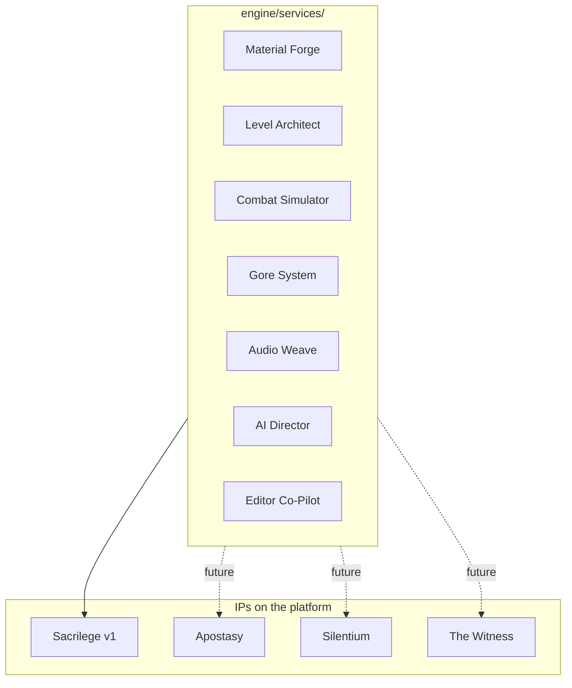

# Cold Coffee Labs — horror studio · Greywater Engine · *Sacrilege*

**Cold Coffee Labs** is a **horror studio**. We build **Greywater Engine** (C++23 / Vulkan) as a **franchise content platform** and we ship ***Sacrilege*** as its flagship title. The engine exists to serve *Sacrilege* at v1 and an IP-agnostic horror-game pipeline thereafter (*Apostasy*, *Silentium*, *The Witness*).

This repository is the monorepo for:

- **Greywater Engine** — proprietary engine: ECS, jobs, Vulkan renderer, editor, `engine/world/`, `engine/ai_runtime/`, `engine/narrative/`, and the seven franchise services under `engine/services/`.
- ***Sacrilege*** — flagship game; program spec in `docs/07_SACRILEGE.md`, Story Bible in `docs/11_NARRATIVE_BIBLE.md`.
- **BLD** (Brewed Logic Directive) — Rust copilot subsystem linked through a narrow C-ABI.

**Hardware baseline:** AMD Radeon RX 580 8GB @ 1080p. ***Sacrilege* Tier A:** **144 FPS** (see `docs/01_CONSTITUTION_AND_PROGRAM.md` §2.1). **Engine reference / renderer harnesses:** **≥ 60 FPS** where `docs/05_RESEARCH_BUILD_AND_STANDARDS.md` §1.4 applies — not the flagship ship bar.
**Languages:** C++23 (engine, editor, gameplay, runtime AI inference) · Rust stable, 2024 edition (BLD only).
**Compiler:** Clang/LLVM 18+ (clang-cl on Windows, clang on Linux). MSVC and GCC are not supported.
**Build:** CMake 3.28+ with Presets + Ninja · Corrosion for Cargo ↔ CMake · CPM.cmake for SHA-pinned C++ deps (ADR-0110).
**Rendering:** Vulkan **1.3 baseline** on desktop (ADR-0111 reconciles with ADR-0003's dynamic rendering / sync2 / timeline semaphore promotion); 1.2 fallback only for drivers that refuse 1.3. Mesh shaders / ray tracing / work graphs remain Tier G.
**Runtime AI:** on-device ML permitted under `docs/01` §2.2.2 carve-out (C++ inference only, pinned weights, deterministic, seed-fed, rollback-safe, no internet). Primary lib: ggml / llama.cpp CPU backend (ADR-0095).
**UI:** Dear ImGui + docking + viewports + ImNodes + ImGuizmo (editor only) · RmlUi (in-game).
**Platforms:** Windows + Linux from day one; **Steam Deck Tier A** (ADR-0113). macOS / consoles / mobile are post-scope.

*"For I stand on the ridge of the universe and await nothing."*

**Current milestone status (2026-04-21):**
- *First Light* (Phase 1) — engineering **complete**; recording gate open.
- *Foundation Renderer* (Phase 5) — engineering **complete** (`b191ca4`); recording gate open.
- *Foundations Set* (Phase 3) — engineering **complete** (pulled forward through Phase 7 per the 2026-04-20 audit; 101/101 doctest suite green, including the generational-handle ABA guard fixed today).
- *Editor v0.1* (Phase 7) — engineering **complete** across five commit gates (A–E). Gate E wired a cockpit-polish UI inspired by the Cold Coffee Labs reference mock-up: Scene stats, Render Settings (tone-map + SSAO + exposure + histogram), Lighting, and Render Targets, all bound to a shared `editor::render::RenderSettings`. Recording gate open.
- *Brewed Logic* (Phase 9 / BLD + `.gwscene`) — engineering **complete**; ADR-0010–0016 + amended ADR-0007; six waves 9A–9F. Recording gate open.
- *Playable Runtime* (Phase 11) — **complete**; `playable_sandbox` exit gate. *Living Scene* (Phase 13) — **complete**; `living_sandbox`. *Two Client Night* (Phase 14) — **complete**; `netplay_sandbox`. *Ship Ready* (Phase 16) — **complete**; `sandbox_platform_services`.
- *Studio Renderer* (Phase 17) — engineering **complete**; ADR-0074–0082; `MaterialWorld` + `ParticleWorld` + `PostWorld`; `gw_perf_gate_phase17`; `apps/sandbox_studio_renderer` prints the `STUDIO RENDERER` exit marker; `dev-win` CTest **711/711** (see `docs/02_ROADMAP_AND_OPERATIONS.md` §Phase 17 and `docs/09_NETCODE_DETERMINISM_PERF.md` — merged **Phase 17 performance budgets — Studio Renderer**).

---

## Getting started

1. **Read** [`CLAUDE.md`](CLAUDE.md) — the cold-start primer for every session.
2. **Build** per [`docs/05_RESEARCH_BUILD_AND_STANDARDS.md`](docs/05_RESEARCH_BUILD_AND_STANDARDS.md) *(merged `BUILDING.md`)*.
3. **Read** [`docs/README.md`](docs/README.md) — map of the **eleven** canonical Markdown files under `docs/` (plus auxiliary `docs/COMPOSER_CONTEXT.md`).

```bash
# Linux
cmake --preset dev-linux
cmake --build --preset dev-linux
./build/dev-linux/bin/gw_sandbox   # hello-triangle (Phase 1 First Light)
./build/dev-linux/bin/gw_editor    # BLD C-ABI greeting
ctest --preset dev-linux

# Windows (clang-cl; no Visual Studio required)
cmake --preset dev-win
cmake --build --preset dev-win
.\build\dev-win\bin\gw_sandbox.exe
.\build\dev-win\bin\gw_editor.exe
.\build\dev-win\bin\gw_tests.exe
ctest --preset dev-win
```

### IDE / `compile_commands.json` (clangd, clang-tidy)

After configure, CMake copies `compile_commands.json` from the build directory to the **repo root** (gitignored). Use the same preset for local work and CI so paths stay aligned:

- Configure: `cmake --preset dev-win` or `cmake --preset dev-linux`
- Build common targets: `gw_editor`, `gw_tests`, `sandbox_playable` (outputs under `build/<preset>/bin/`)
- **Release Windows:** `cmake --preset release-win` — same toolchain as `dev-win`; ensure `clang-cl` is on `PATH` (e.g. **x64 Native Tools** / **Developer PowerShell** with LLVM). CI `windows-latest` runs `clang-cl --version` before configure.

**Detached play / PIE env (`GW_*`):** `sandbox_playable` and `gw::runtime::parse_playable_cli` read these when CLI flags are omitted: `GW_PLAY_SCENE` (scene path), `GW_UNIVERSE_SEED` (integer seed), `GW_CVARS_TOML` (companion `.play_cvars.toml`). Editor PIE sync merges the same TOML + seed into an editor-owned registry via `gw::play::apply_play_bootstrap_to_registry`.

Linux CI runs `run-clang-tidy` against `build/dev-linux/compile_commands.json` (see `.github/workflows/ci.yml`).

---

## Repository layout

```
engine/
    core/           Platform, memory, log, crypto, crash_reporter
    render/         Vulkan HAL + frame graph + forward+ + post + HDR output
    world/          Blacklake: universe (HEC+SDR) + gptm + streaming + biome + origin
    ai_runtime/     On-device C++ inference (ggml CPU) — Director, symbolic music, material eval
    narrative/      dialogue_graph, act_state, sin_signature, voice_director, grace_meter
    services/       Seven IP-agnostic franchise services (material_forge, level_architect,
                    combat_simulator, gore, audio_weave, director, editor_copilot)
    a11y/ i18n/     Accessibility (Phase 16) + localization
    ...             jobs, ecs, math, physics, anim, audio, input, ui, net, persist, telemetry
editor/         Native C++ editor (theme registry, declarative modules, Sacrilege panels,
                PIE F5-from-cursor, BLD copilot)
apps/           Sandbox executables (sandbox_playable, sandbox_studio, sandbox_director,
                sandbox_deck_probe, sandbox_infinite_seed, ...)
sandbox/        First-Light triangle test bed
runtime/        Shipping runtime executable
gameplay/       Hot-reloadable C++ dylib: martyrdom, characters (malakor_niccolo), acts,
                boss (logos), mod_example
bld/            BLD — Rust workspace with 10 crates (MCP, tools, tools-macros, provider,
                RAG, agent, governance, bridge, ffi, replay)
tools/
    cook/       gw_cook content cooker CLI (Ed25519 content signing)
    cook/ai/    Offline ML pipelines: vae_weapons, wfc_rl_scorer, music_symbolic_train,
                neural_material, director_train (Python under §2.2.1 carve-out)
    lint/       CI lints (exceptions, iostream, raw threads, git pins, CPM SHA pins, ...)
tests/          doctest unit + integration + perf + fuzz + determinism
assets/         Cooked deterministic runtime assets (tracked); assets/ai/ holds pinned ML weights
content/        Source assets (gitignored)
cmake/          CPM.cmake, dependencies.cmake, toolchains, packaging
docs/           Eleven canonical Markdown files (read docs/README.md) + docs/11_NARRATIVE_BIBLE.md
.github/        CI workflows (matrix + sanitizers + Miri + fuzz + determinism + steam_deck)
```

## The seven franchise services

The engine is factored into **seven IP-agnostic services**. *Sacrilege* is the v1 consumer; future IPs pick up the whole set unmodified.



Each service is a CMake `INTERFACE` schema header paired with a concrete `_impl` target. Data schemas live in `engine/services/<svc>/schema/` and are declared IP-agnostic by contract (ADR-0102).

Engine code never `#include`s from `gameplay/`. The engine/game boundary is enforced in the review rubric (`docs/03_PHILOSOPHY_AND_ENGINEERING.md` §K).

---

## The canonical set (binding)

The `docs/` folder is intentionally **twelve canonical** Markdown files (eleven L0–L7 stack docs + `docs/11_NARRATIVE_BIBLE.md` as an L4-sibling Story Bible) plus **`docs/COMPOSER_CONTEXT.md`** as an auxiliary Composer primer (see [`docs/README.md`](docs/README.md)).

| | |
| --- | --- |
| [`CLAUDE.md`](CLAUDE.md) | Cold-start primer + non-negotiables |
| [`docs/01_CONSTITUTION_AND_PROGRAM.md`](docs/01_CONSTITUTION_AND_PROGRAM.md) | Constitution (incl. §2.2.2 runtime-AI carve-out), executive brief, handoff |
| [`docs/02_ROADMAP_AND_OPERATIONS.md`](docs/02_ROADMAP_AND_OPERATIONS.md) | Roadmap, milestones, Kanban |
| [`docs/03_PHILOSOPHY_AND_ENGINEERING.md`](docs/03_PHILOSOPHY_AND_ENGINEERING.md) | Brew doctrine + horror-studio posture + content-engine principles |
| [`docs/04_SYSTEMS_INVENTORY.md`](docs/04_SYSTEMS_INVENTORY.md) | Subsystem inventory (incl. Runtime AI, Narrative, Franchise Services) |
| [`docs/05_RESEARCH_BUILD_AND_STANDARDS.md`](docs/05_RESEARCH_BUILD_AND_STANDARDS.md) | Vulkan/C++/Rust guides, build, coding standards, deterministic-ML |
| [`docs/06_ARCHITECTURE.md`](docs/06_ARCHITECTURE.md) | Blueprint + core architecture (ai_runtime, narrative, services) |
| [`docs/07_SACRILEGE.md`](docs/07_SACRILEGE.md) | Flagship program spec |
| [`docs/08_BLACKLAKE.md`](docs/08_BLACKLAKE.md) | Blacklake — arena generation (HEC, SDR, GPTM) + cook-time AI |
| [`docs/09_NETCODE_DETERMINISM_PERF.md`](docs/09_NETCODE_DETERMINISM_PERF.md) | Netcode, determinism (incl. runtime-AI determinism), perf annexes |
| [`docs/10_APPENDIX_ADRS_AND_REFERENCES.md`](docs/10_APPENDIX_ADRS_AND_REFERENCES.md) | Glossary, appendix, **all ADRs** (up to ADR-0117) |
| [`docs/11_NARRATIVE_BIBLE.md`](docs/11_NARRATIVE_BIBLE.md) | Sacrilege Story Bible — cosmology, cast, three Acts, Grace finale, franchise future |

---

## Studio

**Cold Coffee Labs** — founder: <slicedlabs.founder@proton.me>

*Brewed slowly. Built deliberately. Shipped by Cold Coffee Labs.*
