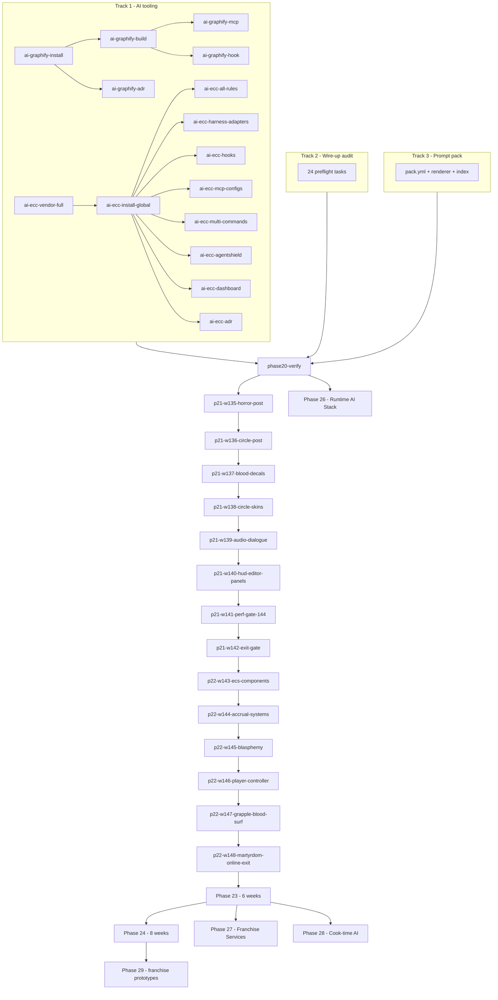

# 12 - Prompt Pack

**Status:** Operational - authoritative source is `docs/prompts/pack.yml`.
**Horizon:** 24 preflight fixes + 44 phase-week tasks + 16 AI-tooling tasks + 2 rails = **95 tasks** rendered to individual markdown files.

> This pack is the agent-ready manifest for driving Greywater Engine to the
> Sacrilege Release Candidate (Phase 24) and through the franchise tail
> (Phase 29). Each entry is a self-contained prompt you can paste into
> Cursor + Claude Opus 4.7 high, citing ADRs and exit criteria by design.

---

## How to use

1. Pick a task id (e.g. `p21-w137-blood-decals`).
2. Open the rendered prompt at `docs/prompts/<bucket>/<id>.md`.
3. Paste the **Prompt** section into a fresh Cursor chat with Claude Opus
   4.7 high. Attach the files named in **Inputs** when they exist; let the
   agent touch those named in **Writes**.
4. When the **Exit criteria** are all green, commit with Conventional
   Commits (`feat(p21): blood decal system …`).
5. Tick the matching checkbox in `docs/02_ROADMAP_AND_OPERATIONS.md`.

**Do not** hand-edit the rendered files. They are produced from
`docs/prompts/pack.yml` by `tools/prompts/render_pack.py`
(or `render_pack.ps1` for contributors without Python). A CI lint
(`tools/lint/check_prompt_pack.py`) fails the build if the render drifts.

---

## Buckets

| Bucket | Count | Path |
|--------|-------|------|
| Preflight (wire-up) | 24 | `docs/prompts/preflight/` |
| Phase 20 verification | 1 | `docs/prompts/phase20/` |
| Phase 21 - Hell Frame | 8 | `docs/prompts/phase21/` |
| Phase 22 - Martyrdom & God Mode | 6 | `docs/prompts/phase22/` |
| Phase 23 - Encounters + God Machine | 6 | `docs/prompts/phase23/` |
| Phase 24 - Hardening & Release | 8 | `docs/prompts/phase24/` |
| Phase 26 - Runtime AI Stack | 8 | `docs/prompts/phase26/` |
| Phase 27 - Franchise Services | 6 | `docs/prompts/phase27/` |
| Phase 28 - Cook-time AI | 6 | `docs/prompts/phase28/` |
| Phase 29 - Franchise Pre-Prod | 4 | `docs/prompts/phase29/` |
| AI tooling (graphify + ECC) | 16 | `docs/prompts/ai_tooling/` |
| Docs + CI rails | 2 | `docs/prompts/{docs,ci}/` |

---

## Execution DAG (high level)

---

## Authoring rules

### Adding a task

1. Append a task block to `docs/prompts/pack.yml`.
2. Include every field (`id`, `kind`, `tier`, `title`, `depends_on`,
   `inputs`, `writes`, `exit_criteria`, `prompt`). Unknown task kinds
   are rejected by the renderer.
3. Run `powershell -File tools/prompts/render_pack.ps1`
   (or `python tools/prompts/render_pack.py`).
4. Commit both `pack.yml` and the rendered files in the same PR.

### Changing a task

Edit `pack.yml` only. Never edit the rendered markdown directly - it is
overwritten by the renderer on every run.

### Dependency hygiene

`depends_on` must reference ids that exist in the same pack. The renderer
validates the DAG and fails loudly on dangling references. Cycles are
still your responsibility - keep the DAG acyclic by cutting at the
sandbox-exit-gate seams.

---

## ADR references

- **ADR-0097** - Pinned RL policies for the Director (feeds Phase 26).
- **ADR-0104** - Three-profile editor theme (feeds `pre-ed-theme-menu`).
- **ADR-0108** - Horror-post single-pass compute (feeds `p21-w135-horror-post`).
- **ADR-0110** - CPM dependency SHA/tag pinning.
- **ADR-0111** - Vulkan 1.3 baseline.
- **ADR-0114** - Ed25519 content signing (feeds `pre-tc-content-signing`).
- **ADR-0117** - Editor + gameplay a11y surface (feeds `pre-ed-a11y-init`).
- **ADR-0118** - Graphify AI knowledge graph (feeds `ai-graphify-*`).
- **ADR-0119** - Everything-Claude-Code full adoption (feeds `ai-ecc-*`).
- **ADR-0120** - AgentShield supply-chain gate.

---

*The phase is the contract. The week is the budget. The prompt is the path.*
